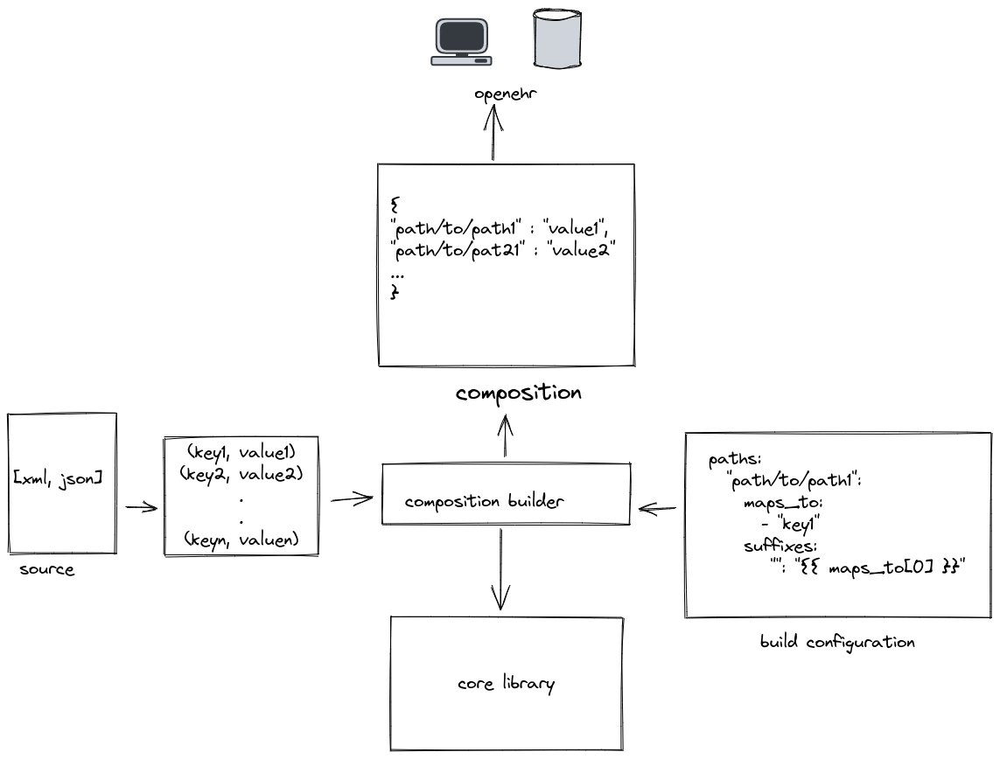

# FLATEHR

[](https://github.com/crs4/flatehr/actions/workflows/main.yaml)


**FLATEHR** is a *low-code* Python tool for creating [openEHR](https://www.openehr.org/) **compositions** from different kind of sources. At the moment, **xml** and **json** sources are supported.
Generated compositions are formatted according to the [flat (simSDT) format](https://specifications.openehr.org/releases/ITS-REST/latest/simplified_data_template.html). 


**TL;DR:** it allows to populate compositions mapping key-values generated from a source (for example a XPATH and its relative values from an xml file) to simSDT paths. 
The mapping is configured via a **yaml** file.
See the [examples section](#Examples) for more details.

## Installation
Dependencies:
 * [Poetry](https://python-poetry.org/): pip install poetry

 For installing FLATEHR, first enable virtualenv:

```
$ poetry shell
```

Then run:

```
$ make install
```

## CLI
Main command:

```
$ flatehr -h
usage: flatehr [-h] [--version] {generate,inspect} ...

positional arguments:
  {generate,inspect}
    inspect           Shows the template tree, with info about type, cardinality,
                      requiredness and optionally aql path and expected inputs.

optional arguments:
  -h, --help          show this help message and exit
  --version           show program's version number and exit

```

### Generating Configuration

For generating the configuration skeleton from a template, run:
```
$ flatehr generate skeleton -h
usage: flatehr generate skeleton [-h] template_file

Generate a configuration skeleton for the given template.

positional arguments:
  template_file  the path to the web template (json)

optional arguments:
  -h, --help     show this help message and exit

```

### Generating a Composition

For generating a composition, use this subcommand:
```
$ flatehr generate from-file -h
usage: flatehr generate from-file [-h] -t TEMPLATE_FILE -c CONF_FILE [-r RELATIVE_ROOT] [-s | --skip-ehr-id | --no-skip-ehr-id] input_file

Generates composition(s) from a file. xml and json sources supported.
Prints on stdout an external ehr id (if flag --skip-ehr-id is not set) and the flat composition.
If --relative-root is set, as many compositions are generated as keys with the given value exists in the source.

positional arguments:
  input_file            source file

optional arguments:
  -h, --help            show this help message and exit
  -t TEMPLATE_FILE, --template-file TEMPLATE_FILE
                        web template path
  -c CONF_FILE, --conf-file CONF_FILE
                        yaml configuration path
  -r RELATIVE_ROOT, --relative-root RELATIVE_ROOT
                        id for the root(s) that maps 1:1 to composition
                        (default: None)
  -s, --skip-ehr-id, --no-skip-ehr-id
                        if set, ehr_id is not printed
                        (default: False)

```

For an example, try:
```bash
$ flatehr generate from-file -t tests/resources/web_template.json -c tests/resources/xml_conf.yaml --skip-ehr-id tests/resources/source.xml
```

### Inspecting a template

For inspecting a template, run:
```
$ flatehr inspect -h
usage: flatehr inspect [-h] [-a | --aql-path | --no-aql-path] [-i | --inputs | --no-inputs] template_file

Shows the template tree, with info about type, cardinality,
requiredness and optionally aql path and expected inputs.

positional arguments:
  template_file         path to the web template (json)

optional arguments:
  -h, --help            show this help message and exit
  -a, --aql-path, --no-aql-path
                        flag, if true shows the aql path for each node
                        (default: False)
  -i, --inputs, --no-inputs
                        flag, if true shows the inputs for each node
                        (default: False)

```


## Features
 * N:N mappings between source keys and flat paths
 * source keys order preserved, helpful for properly managed multiple cardinality RM objects
 * render values using jinja templates
 * use a value map to converts the source values
 * retrieve values from the web template using jq
 * set null flavour when some mapping is missing
 * set missing required values to the default value (defined in the web template)
 * automatic configuration skeleton generation
 * inspect a template

## Architecture

## Examples
Here is an excerpt from *tests/resources/json_conf.yaml*. It maps the source *tests/resources/source.json* to a composition defined by the template *tests/resources/web_template.json* (see also *template.opt* and *template.zip* in the same directory) 
It uses the jsonpath syntax adopted by [jsonpath-ng](https://github.com/h2non/jsonpath-ng) library.

```yaml
paths:
  test/patient_data/gender/biological_sex: # destination path (completed by the suffixes below)
    maps_to: #list of source key maps expressed as jsonpath
     - "$..Dataelement_85_1.'#text'"
    suffixes:
      "|value" : "{{ maps_to[0] | upper }}" # suffixes are rendered as jinja templates, `maps_to` are available
      "|code":
        value: '.inputs[0].list[] | select (.label == "{{ maps_to[0] | upper }}") | .value'
        jq: true # if jq is true, the rendered value is passed as argument jq. The json input is the relative web template
      "|terminology" :
        value: '.inputs[0].terminology'
        jq: true
    null_flavor: # if not all `maps_to` are available, null flavour can be used
      value: unknown
      code: 253
      terminology: openehr

  ctx/language: en #for static value it is as simple as that

  ctx/territory:
    maps_to:
      - "$..Location.@name"
    suffixes:
      "|code": "{{ value_map[maps_to[0]]  }}"
      "|terminology" : "ISO_3166-1"
    value_map: # you can define a value_map that is available in the suffixes
      test: IT
      le test: FR

  test/histopathology/result_group/laboratory_test_result/any_event: #non leaf path with multiple cardinality can be mapped, they are increased when mapping occurs
    maps_to:
      - "$..Event[?(@.@eventtype == 'Histopathology')]"


```

For more exaustive examples, see *tests/test_cli.sh*.


## Ingesting
From parallel ingesting multiple sources to an openEHR istance, take a look at *scripts/ingest.sh*.


